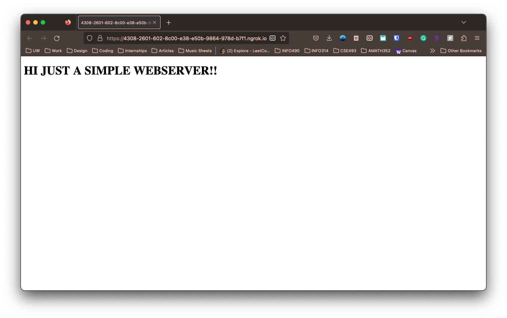
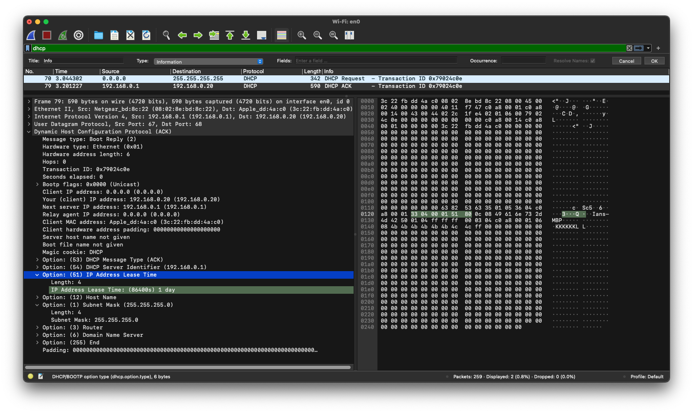
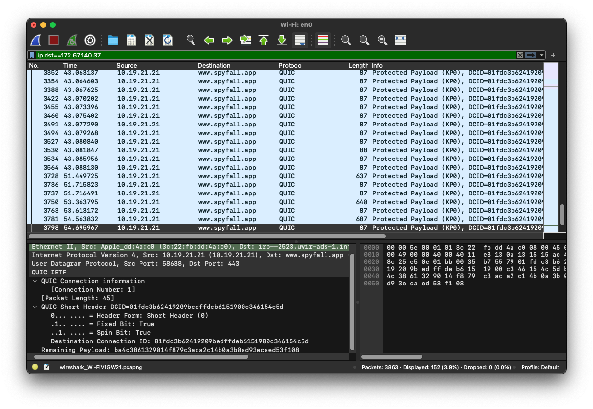
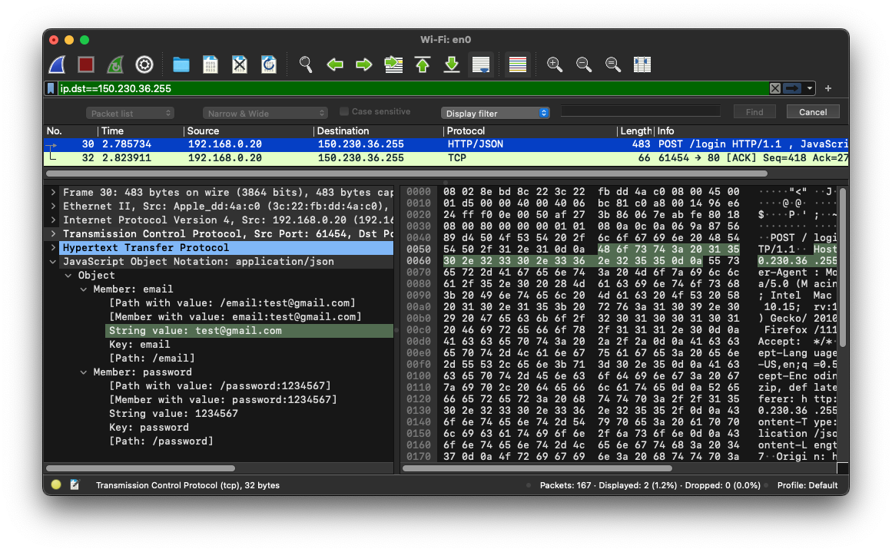

# tcptools

## Using "ping"

| Website           | Stats                         | Packet Loss? | IP change? |
| ----------------- | ----------------------------- | -------------|------------|
| www.amazon.com    | 17.495/40.106/77.141/19.916 ms |  No Loss | IP changed between pings from 108.138.91.214 to 18.65.233.187 |   
||15.901/27.394/50.364/12.163 ms| | |
||16.812/26.986/39.972/9.283 ms| | |
| www.google.com    | 11.039/26.290/37.309/8.655 ms | Packet loss for the 2nd ping for www.google.com on the 4th packet. | No change |
||11.658/33.834/77.469/25.634 ms|
||11.468/23.927/43.504/10.729 ms|
| www.microsoft.com | 13.736/17.636/22.317/2.827 ms | No Loss | No Change |
||11.818/17.687/23.055/4.314 ms| | |
||12.525/17.715/22.076/4.103 ms| | |

- There was packet loss for the 2nd ping for www.google.com on the 4th packet. No packet loss for the other websites.
- The IP address changed for www.amazon.com between pings from 108.138.91.214 to 18.65.233.187. No changing of IP address for other websites.

## Using "tracert"
**www.amazon.com**
- Target Server's IP address: Timed Out/Never Reached
- Did not reach target, this is because tracroute uses groups of ICMP messages and usually network admins block ICMP packets to protect their network (through obscuring the structure and preventing DoS)
- Comcast
- IP Class
   - 192.168.0.1 - Class C
   - 100.92.123.67 and 100.92.123.66 - Class A
   - 24.153.87.17, 69.139.164.81, and 68.86.93.5  - Class A
   - 24.124.128.121, 96.110.39.202, 96.110.39.226, and 96.110.32.234 - Class A
   - 75.149.228.150 - Class A
   - 66.208.229.158 - Class A
   - 15.230.247.0 and 15.230.247.1 - Class A

**www.google.com**
- Target Server's IP address: 142.250.69.196
- 12 hops needed to reach target
- Comcast
- IP Class
   - 192.168.0.1 - Class C
   - 100.92.123.66 and 100.92.123.67 - Class A
   - 24.153.87.25 and 24.153.87.17 - Class A
   - 69.139.160.198, 69.139.160.249, and 69.139.164.81 - Class A
   - 24.124.128.121 - Class A
   - 50.218.57.26, 50.222.176.214, and 50.222.176.21 - Class A
   - 142.251.50.244 and 209.85.254.246 - Class A
   - 142.250.69.196 and 142.251.50.176 - Class A

**www.microsoft.com**
- Target Server's IP address: Traceroute output does not reveal target IP address for Microsoft, ends at Akamai Technologies which is a CDN.
- 8 hops needed to reach target
- Comcast
- IP Class
   - 192.168.0.1 - Class C
   - 100.92.123.66 and 100.92.123.67 - Class A
   - 24.153.87.25 and 24.153.87.17 - Class A
   - 69.139.160.198 and 69.139.164.81 - Class A
   - 24.124.128.129 - Class A
   - 69.139.160.217 - Class A
   - 96.216.153.5 - Class A
   - 23.45.229.117 - Class A

## Extra credit: Using "ngrok" (2 pts)
refer to 'ngrok' dir for index.html

## Extra credit: Using packet-capture tools (2 pts)

## Extra credit: Extra credit: Spy on your opponents (2 pts)

## Extra credit: Insecure web server (2 pts)
